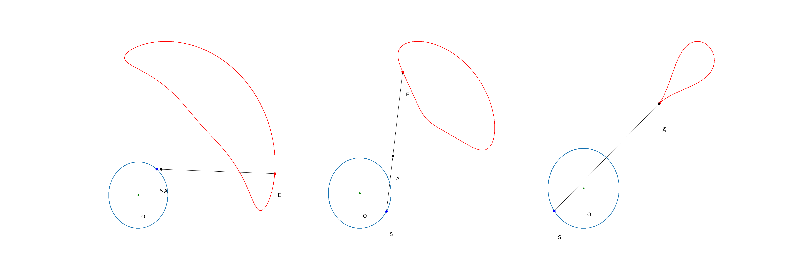

# mamcw.prj

Mechanics & Machines Coursework.

## Inspiration

### Wittgenstein's Rod

However, there is a notable difference:

- Wittgenstein's rod has fixed middlepoint and the first point is moving in a circlular path.
- Our mechanism has a middlepoint moving on the circular path, while the first point is fixed

## Dynamics

All the derivations of the current dynamics model can be seen [here](Publication/notebooks/actual_dynamics.ipynb). While the class for numerical simulation and analysis can be found [here](Publication/notebooks/dynamics_refined.ipynb). Current dynamics example as follows (no external forces, only gravity): 
